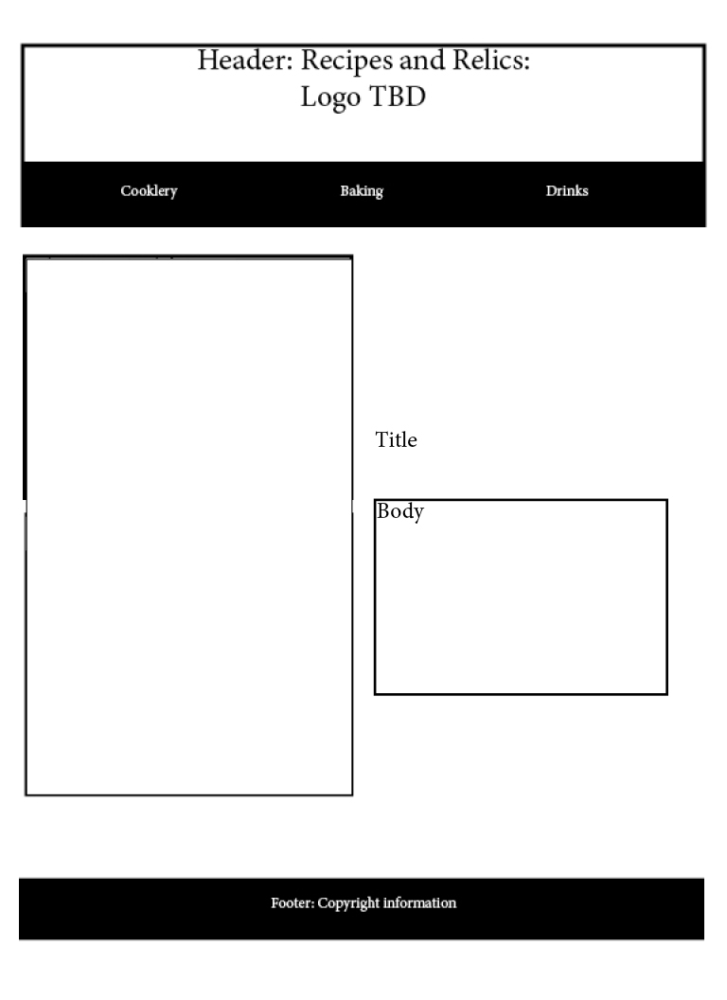
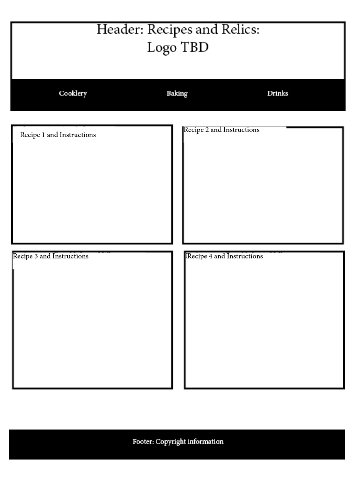

# INF6420 Recipes and Relics 

This website will serve as a virtual family recipe book. There will be both a record of any related stories and recipe directions on the website.

## Wireframes 

These wireframes are for the home page, cookry, baking and drinks pages. Each of the recipe pages will follow a similar format. 

Header - The header will have a navigation menu that will remain on each page and the title of the page, in this case: Recipes and Relics for now. 

Navigation Menu - There will be links to other pages: cooking, baking and drinks. 

Main Content - There will be a brief overview of the purpose of the website with a family event photo. 

Footer - Copyright information 

Header - Similarly, the navigation menu and title will remain.

Navigation Menu - There will be links to other pages: cooking, baking and drinks. 

Main Content - There will be brief stories or recipes, divided into a grid format, possibly photos. 

Footer - Copyright information 

Header - The navigation menu and title will remain.

Navigation Menu - There will be links to other pages: cooking, baking and drinks. 

Main Content - There will be brief stories or recipes, divided into a grid format, possibly photos.  

Footer Copyright information 

Header - The navigation menu and title will remain.

Navigation Menu - There will be links to other pages: cooking, baking and drinks. 

Main Content - There will be brief stories or recipes, divided into a grid format, possibly photos. 

Footer Copyright information 
 